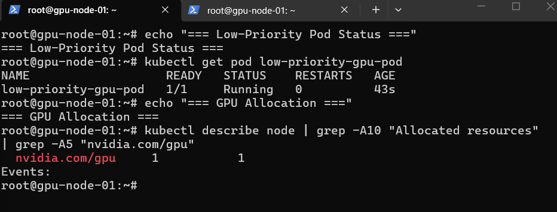
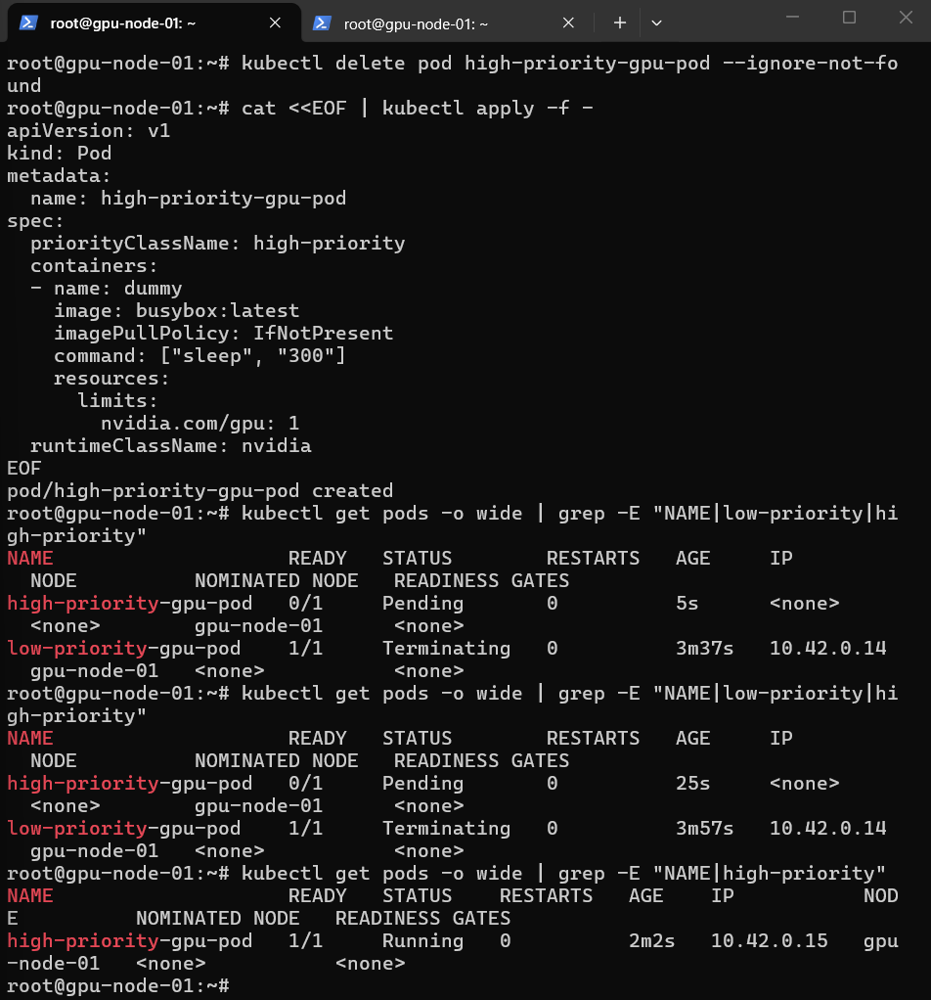

```markdown
# GPU-Aware Inference Platform on Kubernetes  
**Volcano Scheduling × DCGM Observability**

> 基于 Kubernetes 构建 GPU 推理平台的底座：手动注册 GPU 资源、实现优先级抢占调度，并搭建 GPU 实时监控体系。  
> 本项目所有操作均在实际云 GPU 环境中完成，并提供完整的自动化脚本与排障文档。

---

## ✨ 核心特性

- ✅ **GPU 资源注册与管理**：通过 NVIDIA Device Plugin 将物理 GPU 抽象为 Kubernetes 可调度资源
- ✅ **优先级抢占调度**：集成 Volcano 调度器，实现高优任务对低优任务的抢占，保障关键任务 SLA
- ✅ **GPU 实时监控**：DCGM Exporter + Prometheus + Grafana 采集 GPU 温度、显存、利用率等指标
- ✅ **一键部署与演示**：提供 `setup.sh` 一键部署核心组件，`run_exp.sh` 自动执行抢占演示
- ✅ **真实排障文档**：记录从零搭建到 GPU 抢占过程中的 15+ 个典型故障及解决方案

---

## ⚙️ 技术栈

| 层级         | 组件                                                 |
| ------------ | ---------------------------------------------------- |
| 容器编排     | K3s v1.36.2                                          |
| GPU 支持     | NVIDIA Container Toolkit, NVIDIA Device Plugin       |
| 调度增强     | Volcano (Queue + PriorityClass)                      |
| 监控与可视化 | Prometheus, Grafana, DCGM Exporter                   |
| 镜像管理     | 阿里云 ACR 私仓（解决网络受限场景下的镜像拉取）      |
| 基础设施脚本 | Bash, Kubernetes YAML, Helm                          |

---

## 📁 项目结构

```
.
├── README.md
├── .gitignore
├── scripts/
│   ├── init-system.sh               # 系统初始化与包修复
│   ├── install-k3s.sh               # k3s 安装 + 镜像加速
│   ├── install-nvidia-toolkit.sh    # 安装 nvidia-container-runtime
│   ├── start-k3s.sh                 # k3s 启动与验证
│   ├── setup.sh                     # 一键部署 GPU 调度与监控栈
│   └── run_exp.sh                   # 自动执行 GPU 优先级抢占演示
├── deploy/
│   ├── registries.yaml              # 容器镜像加速配置
│   ├── nvidia-device-plugin.yaml    # NVIDIA Device Plugin DaemonSet
│   ├── k3s.service                  # k3s systemd 服务文件
│   ├── volcano/
│   │   ├── queue-and-priority.yaml  # Queue + PriorityClass 定义
│   │   └── low-high-pods.yaml       # 示例高/低优先级 Pod
│   └── monitoring/
│       └── monitoring-components.yaml  # Prometheus + Grafana + DCGM Exporter 部署
├── docs/
│   ├── k3s-troubleshooting.md       # K3s 部署全故障排障（真实日志）
│   └── gpu-plugin-troubleshooting.md  # GPU 插件排障（段错误、注册超时等）
├── screenshots/
│   ├── 1-gpu-occupied.png           # 低优 Pod 占用 GPU 截图
│   └── 2-high-priority-running.png  # 高优 Pod 抢占成功截图
└── monitoring/                      # 监控相关（已整合至 YAML）
```

---

## 🚀 快速开始

### 环境要求
- 一台带 NVIDIA GPU（如 Tesla T4）的 Ubuntu 22.04 服务器
- 已安装 NVIDIA 驱动 (≥ 535) 和 CUDA (≥ 12.2)
- 建议配置阿里云 ACR 私仓以解决公网访问限制（项目内已提供配置模板）

### 部署步骤

```bash
# 克隆仓库
git clone https://github.com/your-org/gpu-inference-platform.git
cd gpu-inference-platform

# 1. 一键部署 GPU 调度与监控组件
bash scripts/setup.sh

# 2. 运行优先级抢占演示
bash scripts/run_exp.sh
```

`setup.sh` 将依次部署：
- **NVIDIA Device Plugin** （使 Kubernetes 识别 GPU）
- **Volcano Queue + PriorityClass** （定义 GPU 队列与优先级）
- **Prometheus + Grafana + DCGM Exporter**（GPU 监控栈）

`run_exp.sh` 将自动创建低优先 Pod（占用 GPU）、高优先 Pod（触发抢占）并输出全过程日志，可直接用于演示或截图。

---

## 📸 优先级抢占演示效果

### 低优先级 Pod 抢占前占用 GPU


### 高优先级 Pod 提交后抢占成功


高优任务提交后，低优任务被驱逐，GPU 分配给高优任务，证明优先级抢占机制生效。

---

## 🛠️ 排障文档

本项目在真实云环境部署过程中遇到并解决**六大类典型故障**，详细过程已整理为排障指南：

- [K3s 部署全故障排障](docs/k3s-troubleshooting.md)：镜像拉取超时、CNI 未初始化、kine.sock 丢失、systemd 端口冲突等（含真实日志与命令）
- [GPU Device Plugin 排障](docs/gpu-plugin-troubleshooting.md)：容器段错误（exit 139）、注册超时、socket 路径不匹配等

这些文档直接从实际故障中提炼，是展示工程实战能力的重要材料。

---

## 🧪 验证方法

- **GPU 资源成功注册**后，节点详情中将显示：  
  ```
  Capacity:
    nvidia.com/gpu:     1
  Allocatable:
    nvidia.com/gpu:     1
  ```

- **监控栈部署后**，Grafana Dashboard（导入 12239）可实时查看 GPU 温度、显存、利用率等指标。

---


## ✍️ 作者

Wang B.  
本项目为个人学习与技术展示，所有组件均在真实云环境中完成部署与验证。
```